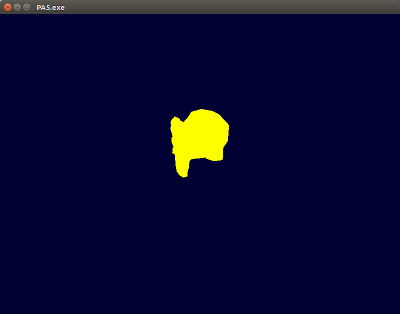

# PA5 - Assimp Model Loading (Ben Nicholes, Denis Morozov, Saharath Kleips)
Sample program that displays the usage of Assimp model loading. The loader current supports various model formats, but will not load any textures or materials associated with them. Controls found below allow the model to be manipulated to better view the loaded models.




## Table of Contents
+ [Program Usage](#program-usage)  
    - [Controls](#controls)
+ [Installation Instructions](#installation-instructions)  
    - [Ubuntu 14.04 LTS (RECOMMENDED)](#ubuntu-1404-lts)
    - [Ubuntu 12.04 LTS](#ubuntu-1204-lts)
    - [Other Linux Distrbutions](#other-linux-distributions)
    - [OSX](#osx)
    - [Windows](#windows)
+ [Build Instructions](#build-instructions)  
+ [Bug Encounters / Error Fixes](#bug-encounters--error-fixes)
    - [Not Found in Mesa Table OpenGL Error](#not-found-in-mesa-table-opengl-error)

## Program Usage
This program features custom model loading from a file path. Click [here](#build-instructions) for instructions on how to add a custom path.

###Controls
<table>
    <tbody>
        <tr>
            <th>Action</th>
            <th>Description</th>
        </tr>
        <tr>
            <td>Keyboard - Up</td>
            <td>Zoom camera in</td>
        </tr>
        <tr>
            <td>Keyboard - Down</td>
            <td>Zoom camera out</td>
        </tr>
        <tr>
            <td>Keyboard - Left</td>
            <td>Rotate model negatively along the x-axis</td>
        </tr>
        <tr>
            <td>Keyboard - Right</td>
            <td>Rotate model postively along the x-axis</td>
        </tr>
        <tr>
            <td>Keyboard - Space</td>
            <td>Reset model rotation</td>
        </tr>
        <tr>
            <td>Keyboard - ESC</td>
            <td>Exit the program</td>
        </tr>
    </tbody>
</table>

## Installation Instructions
**It is recommended that you use Ubuntu 14.04 LTS.**
### Ubuntu 14.04 LTS
Tested with a clean install of Ubuntu 14.04 x64 LTS on VirtualBox 5.0.2r102096 with Guest Additions installed and Windows 8.1 x64 host.  

**g++ Install**
```
sudo apt-get install build-essential
```

**OpenGL Install**
```
sudo apt-get install libgl1-mesa-dev
```

**Qt 5.5 Install**  
Add the Qt5.5 PPAs by [Stephan Banner](https://launchpad.net/~beineri) and then install the latest Qt files.
```
sudo apt-add-repository ppa:beineri/opt-qt55-trusty
sudo apt-get update
sudo apt-get install qt-latest
```

**Set Up Development Environment**  
Your `qtchooser` should now list opt-qt55 as an option.
```
qtchooser --list-versions
```
Add the environment variables to your bashrc file.
```
echo 'export QT_SELECT=opt-qt55' >> ~/.bashrc
```
Restart your terminal.

**Assimp Install**
```
sudo apt-get install libassimp-dev
```

### Ubuntu 12.04 LTS
Tested with a clean install of Ubuntu 12.04 x64 LTS on VirtualBox 5.0.2r102096 with Guest Additions installed and Windows 8.1 x64 host.  

**g++ Install**
```
sudo apt-get install build-essential
```

**OpenGL Install**
```
sudo apt-get install libgl1-mesa-dev
```

**Qt 5.5 Install**  
Add the Qt5.5 PPAs by [Stephan Banner](https://launchpad.net/~beineri) and then install the latest Qt files.
```
sudo apt-add-repository ppa:beineri/opt-qt55
sudo apt-get update
sudo apt-get install qt-latest
```

**Set Up Development Environment**  
Add the environment variables to your bashrc file.
```
cd /opt/qt55/bin
./qt55-env.sh
```
Restart your terminal.

**WARNING: Potentially Unsupported**  
**Assimp Install**
```
sudo apt-get install libassimp-dev
```

### Other Linux Distributions 

Qt can be built from [source code](https://wiki.qt.io/Building_Qt_5_from_Git), and is most likely available in your distribution's repositories. However, an easy way of getting the latest Qt is using the official installer:

Download the [Qt Installer](http://www.qt.io/download-open-source/). Give it executable permissions and run as administrator.
```
chmod +x qt-unified-linux-x64-2.0.2-2-online.run
sudo ./qt-unified-linux-x64-2.0.2-2-online.run
```
Add the Qt binaries to PATH environment variable (assumes default install location of /opt/Qt/:
```
echo "PATH=\$PATH:/opt/Qt/Tools/QtCreator/bin:/opt/Qt/5.5/gcc_64/bin" >> ~/.bashrc
source ~/.bashrc
```

... and that's it!

### OSX

Install VirtualBox. Go get Ubuntu. Brew instructions unavailable.

### Windows

Really?

## Build Instructions
Navigate to the `build` directory.
```
qmake
make
```
Navigate to the `bin` directory.
```
Default model:
./PA5.exe

Custom model:
Place models within the bin directory.
./PA5.exe MODEL_NAME
ex: ./PA5.exe table.obj

Full-Path models:
./PA5.exe /path/to/model/model.obj
ex: ./PA5.exe /models/suzanne.obj
```

Convenince Copy/Paste from the `build` directory:
```
qmake; make; cd ../bin; ./PA5.exe; cd ../build
make; cd ../bin; ./PA5.exe; cd ../build
```

**Note:** `qmake` does not need to be run before `make` everytime, only when the `.pro` file has been changed. Otherwise, simply `qmake` once and `make` from there on out.

## Bug Encounters / Error Fixes
### "Not Found in Mesa Table OpenGL Error"
**Found on:**  
VirtualBox 5.0.2r102096  
Host: Windows 7 Ultimate x64  
Guest: Ubuntu 14.04 LTS x64 (Guest Additions Installed)

VirtualBox 5.0.2r102096  
Host: Windows 8.1 x64  
Guest: Ubuntu 12.04 LTS x64 (Guest Additions Installed)  
**Error:**  
Check `glxinfo`:
```
glxinfo | grep OpenGL
```
glxinfo requires `mesa-utils` installed using:
```
sudo apt-get install mesa-utils
```
The output should resemble the following and contain Chromium and not Mesa:
```
OpenGL vendor string: Humper
OpenGL renderer string: Chromium
OpenGL version string: 2.1 Chromium
OpenGL shading language version string: 4.50 NVIDIA
OpenGL extensions:
```
**Solution:**  
A fix is disabling 3D Hardware Acceleration on your VirtualBox.  
After disabling, your glxinfo should look similar to:
```
OpenGL vendor string: VMWare, Inc.
OpenGL renderer string: Gallium 0.4 on llvmpipe (LLVM 3.6 256 bits)
OpenGL version string: 3.0 Mesa 10.5.2
OpenGL shading language version string: 1.30
OpenGL context flags: (none)
OpenGL extensions:
```
Note: The version string should now contain Mesa rather than Chromium.

**Alternative Solution**  
Download and install VMWare Workstation Player 12.  
Migrate your current virtual machine image and boot from VMWare.  
Install VMWare tools.  